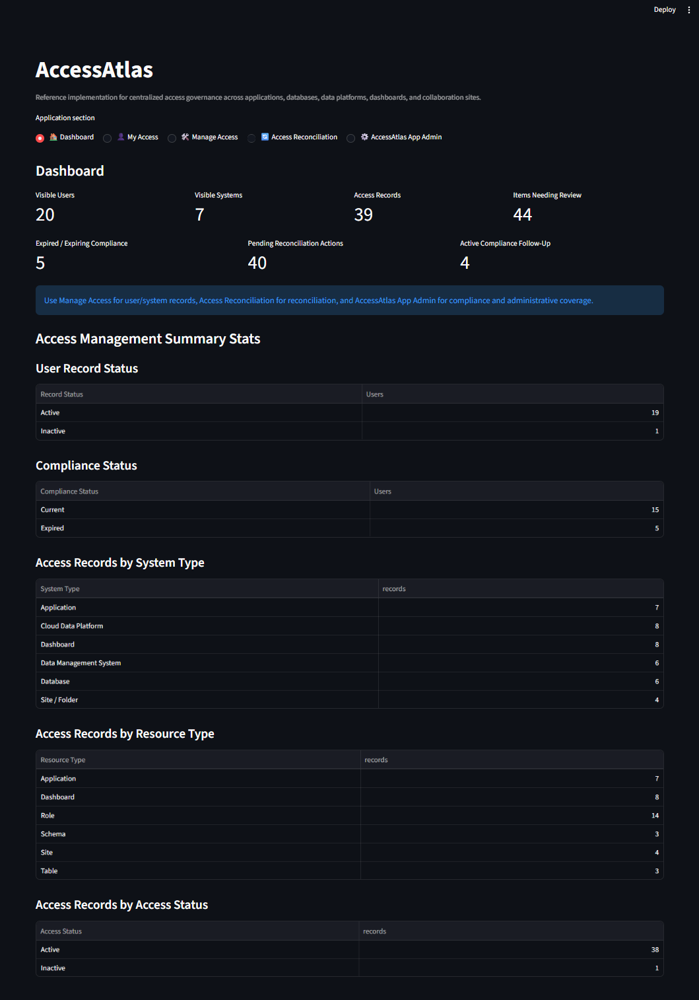
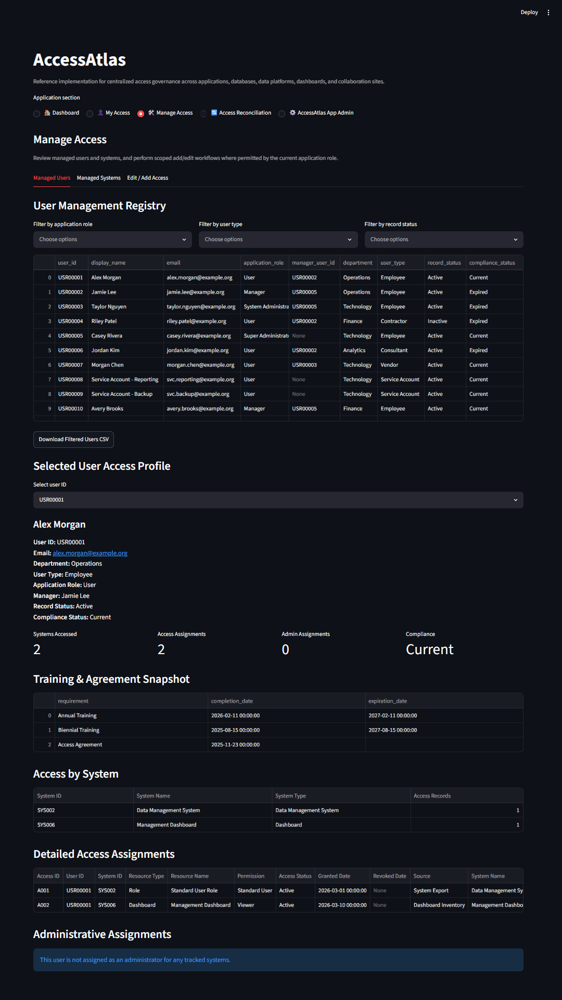
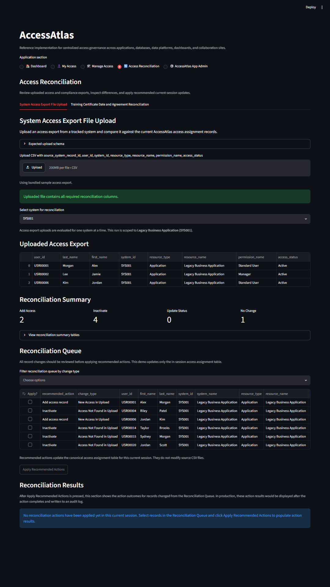
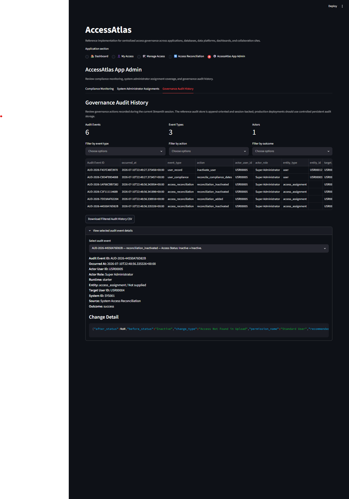
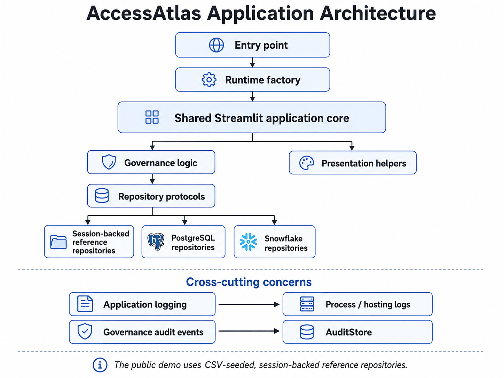

# AccessAtlas

AccessAtlas is a Streamlit-based reference application and deployable starter for centralized access governance, compliance tracking, permission cataloging, and access reconciliation.

It demonstrates how an organization can bring users, systems, permissions, administrator responsibilities, compliance records, and reconciliation workflows into one governance model without tying the design to one database platform or identity provider.

**Live demo:** [https://accessatlas-demo.streamlit.app/]

> The hosted Demo Mode simulates role-based visibility and workflow behavior. It is not authentication or a production authorization mechanism.

## Why AccessAtlas

Organizations often manage access to applications, databases, cloud data platforms, dashboards, collaboration sites, and other controlled resources through separate processes and system-specific records.

That fragmentation makes several basic governance questions surprisingly difficult to answer consistently:

- Who currently has access?
- What system, resource, and permission does that access apply to?
- Who is responsible for administering the system?
- Is the user's required training or agreement documentation current?
- Does an external system export still match the organization's governance record?
- What changed, and what action should be taken?

AccessAtlas provides a platform-neutral reference model for answering those questions.

## What AccessAtlas Demonstrates

AccessAtlas currently demonstrates:

- a centralized governance inventory for users, systems, access assignments, and system administrator assignments
- resource-level access modeled as **User → System → Resource → Permission**
- administrative responsibility modeled separately as **User → System → Administrative Role**
- role-aware views for Users, Managers, System Administrators, and Super Administrators
- compliance monitoring for annual training, biennial training, and access agreement dates
- one-system-at-a-time access reconciliation against a source-system export
- training certificate date and agreement reconciliation
- direct user and access-assignment maintenance within application scope
- scoped CSV exports
- append-oriented governance audit events
- structured operational logging
- a repository boundary that separates Streamlit workflows from persistence

All reference data is synthetic. The default starter and public demo use CSV-seeded, session-backed repositories, so current-session changes are disposable.

## Application Preview

### Role-aware governance overview



The Dashboard summarizes users, systems, access assignments, compliance concerns, and reconciliation activity within the current role scope.

### User and access governance



Managed Users combines a filterable User Management Registry with a detailed Selected User Access Profile.

### Source-system reconciliation



The reconciliation workflow compares a complete source-system export with the governance inventory and presents recommended actions for review.

### Governance action history



Governance Audit History records meaningful actions separately from operational application logs.

## Application Workflows

### Dashboard

The Dashboard provides role-aware metrics and source summary tables for the current visible scope.

`Access Management Summary Stats` includes:

- User Record Status
- Compliance Status
- Access Records by System Type
- Access Records by Resource Type
- Access Records by Access Status

### My Access

My Access provides the current user's governance view.

- **My Record** shows profile, compliance, access, and system administrator assignments.
- **Update My Certification and Agreement Dates** demonstrates self-service compliance-date maintenance.

### Manage Access

Manage Access groups three related work areas:

- **Managed Users** — review scoped users through the User Management Registry and Selected User Access Profile.
- **Managed Systems** — review governed systems through the System Catalog and Selected System Access Profile.
- **Edit / Add Access** — create or update access assignments and add user records where the current application role permits it.

### Access Reconciliation

Access Reconciliation contains two review-and-apply workflows:

- **System Access Export File Upload** compares one selected system's complete access export with the AccessAtlas governance inventory.
- **Training Certificate Date and Agreement Reconciliation** compares externally supplied compliance dates with current user records.

Recommended access reconciliation actions are:

- **Add access record**
- **Inactivate**
- **Update**

Reconciliation answers whether the governance inventory matches a source. It is distinct from access review, which asks whether a user should retain access.

### AccessAtlas App Admin

Visible to the Super Administrator role, AccessAtlas App Admin contains:

- **Compliance Monitoring**
- **System Administrator Assignments**
- **Governance Audit History**

## Role-Aware Experience

| Application role | Visible sections | Primary responsibility demonstrated |
| --- | --- | --- |
| User | My Access | Review own governance record and maintain personal compliance dates |
| Manager | Dashboard, My Access, Manage Access, Access Reconciliation | Review self, direct reports, associated systems, and scoped reconciliation information |
| System Administrator | Dashboard, My Access, Manage Access, Access Reconciliation | Manage users and access within actively administered-system scope |
| Super Administrator | All sections | Review and manage the complete governance model and application administration workflows |

Unavailable sections are not rendered for the current application role.

> Hidden UI controls and client-visible scope are not production authorization. A production deployment must enforce equivalent or stronger authorization in the backend and data-access layer.

## Architecture at a Glance



Operational application logs and governance audit events remain separate:

```text
Application logging
    How is the software behaving?

Governance audit events
    What governance action happened to a record?
```

See [`docs/ARCHITECTURE.md`](docs/ARCHITECTURE.md) and [`docs/DATA_ACCESS.md`](docs/DATA_ACCESS.md) for the full architecture and persistence contracts.

## Quick Start

### 1. Clone the repository

```bash
git clone https://github.com/katieravenwood/AccessAtlas.git
cd AccessAtlas
```

### 2. Create and activate a virtual environment

macOS or Linux:

```bash
python -m venv .venv
source .venv/bin/activate
```

Windows PowerShell:

```powershell
python -m venv .venv
.venv\Scripts\Activate.ps1
```

### 3. Install application dependencies

```bash
python -m pip install -r requirements.txt
```

### 4. Run AccessAtlas

Quick-start single-file starter:

```bash
python -m streamlit run app.py
```

Clean modular starter:

```bash
python -m streamlit run modular/app.py
```

Hosted-demo runtime:

```bash
python -m streamlit run modular/demo_app.py
```

### 5. Optionally select a starter identity

The starter currently supports the `ACCESSATLAS_USER_ID` development identity placeholder.

macOS or Linux:

```bash
ACCESSATLAS_USER_ID=USR-0001 python -m streamlit run app.py
```

Windows PowerShell:

```powershell
$env:ACCESSATLAS_USER_ID = "USR-0001"
python -m streamlit run app.py
```

!(This is for development convenience, not authentication)!

## Starter and Demo Distribution

AccessAtlas publishes three stable Streamlit entry points:

```text
/app.py
/modular/app.py
/modular/demo_app.py
```

- `/app.py` is the generated single-file quick-start starter.
- `/modular/app.py` is the clean modular starter.
- `/modular/demo_app.py` is the hosted role-preview demo.

The canonical engineering source is under `modular/`.

After shared or starter changes:

```bash
python tools/build_single_file.py
python tools/build_single_file.py --check
```

The public demo retains synthetic persona selection and disposable session-backed changes. The clean starter does not render Demo Mode controls or demo-specific guidance.

## Backend Replacement

AccessAtlas uses repository protocols for:

- Users
- Systems
- Access Assignments
- System Administrator Assignments
- Audit Events through the existing `AuditStore` contract

The active repositories are grouped in a `RepositoryContainer`.

`run_app()` accepts a repository factory. A deployment can replace the CSV-seeded session repositories with PostgreSQL, Snowflake, or another implementation without changing Streamlit workflow screens.

See:

- [`docs/DATA_ACCESS.md`](docs/DATA_ACCESS.md)
- [`docs/integrations/POSTGRESQL.md`](docs/integrations/POSTGRESQL.md)
- [`docs/integrations/SNOWFLAKE.md`](docs/integrations/SNOWFLAKE.md)

## Testing and Code Quality

Install development dependencies:

```bash
python -m pip install -r requirements-dev.txt
```

Run the code quality sequence:

```bash
ruff format --check modular tests tools
ruff check modular tests tools
python tools/build_single_file.py --check
pytest -q
```

Ruff checks canonical source, tests, and build tooling. The generated root `app.py` is validated through the single-file synchronization contract rather than formatted or linted directly.

## Documentation

- [`docs/ARCHITECTURE.md`](docs/ARCHITECTURE.md) — application layers, runtimes, repository boundary, logging, audit, and distribution architecture
- [`docs/DATA_ACCESS.md`](docs/DATA_ACCESS.md) — canonical data contracts and repository replacement model
- [`docs/DEPLOYMENT.md`](docs/DEPLOYMENT.md) — production deployment considerations and checklist
- [`docs/UI_STYLE_GUIDE.md`](docs/UI_STYLE_GUIDE.md) — application vocabulary and presentation conventions
- [`docs/architecture/governance_patterns.md`](docs/architecture/governance_patterns.md) — conceptual governance patterns demonstrated by AccessAtlas
- [`docs/integrations/POSTGRESQL.md`](docs/integrations/POSTGRESQL.md) — PostgreSQL repository implementation guidance
- [`docs/integrations/SNOWFLAKE.md`](docs/integrations/SNOWFLAKE.md) — Snowflake repository implementation guidance
- [`docs/user-guides/user-guide.md`](docs/user-guides/user-guide.md) — User role guide
- [`docs/user-guides/manager-guide.md`](docs/user-guides/manager-guide.md) — Manager role guide
- [`docs/user-guides/system-admin-guide.md`](docs/user-guides/system-admin-guide.md) — System Administrator guide
- [`docs/user-guides/super-admin-guide.md`](docs/user-guides/super-admin-guide.md) — Super Administrator guide

## Project Status

The core 1.0.0 starter foundation is materially complete:

- canonical modular source and generated quick-start distribution
- separate starter and hosted-demo runtimes
- structured application logging
- governance audit-event model
- scoped CSV exports
- broader automated tests
- Ruff linting and formatting checks
- repository data-access boundary
- migration guidance for PostgreSQL and Snowflake

Current work is focused on documentation, diagrams, screenshots, deployment guidance, repository readiness, and final 1.0.0 release review.

Notifications remain the first planned functional module after the 1.0.0 foundation.

See [`ROADMAP.md`](ROADMAP.md) for product direction and [`CHANGELOG.md`](CHANGELOG.md) for development history.

## License

AccessAtlas is licensed under the MIT License. See [`LICENSE`](LICENSE).
