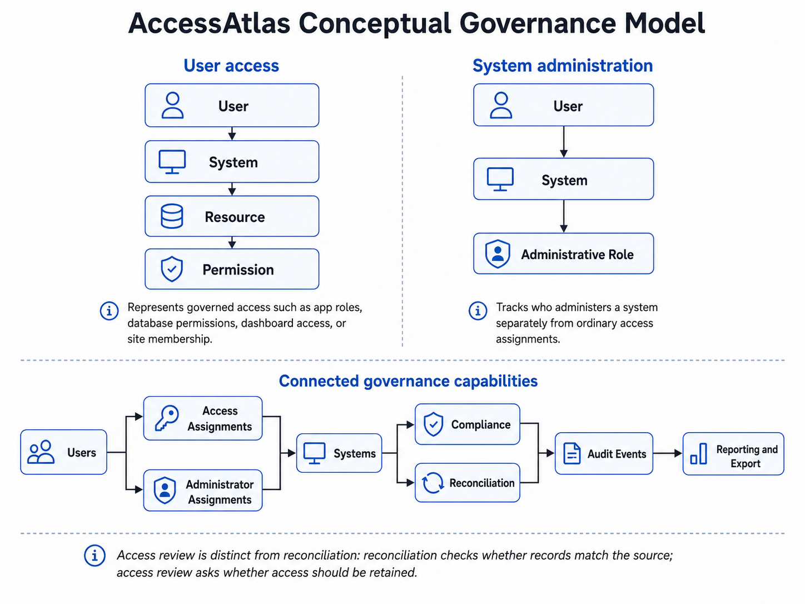

# AccessAtlas Governance Patterns

AccessAtlas demonstrates a set of connected access-governance patterns rather than a single identity, database, or application technology.

The patterns describe the governance layer around access. They do not replace authentication, authorization enforcement, provisioning, or formal access approval processes.

## Governance Model

AccessAtlas uses two primary relationships.



The conceptual model above shows these governance capabilities as connected rather than strictly sequential. User and system records anchor both access and administrative assignments, while compliance and reconciliation create governance context that can produce audit events and downstream reporting or export.

### User access

This relationship can represent:

- application access
- application roles
- Snowflake roles or grants
- database, schema, or table permissions
- dashboard or report access
- hosting-site access
- collaboration-site or group membership

### System administration

System administration is intentionally separate from user access.

A person may administer a system without the same permission model used for ordinary resource access. One user may administer multiple systems, and one system may have multiple administrators.

## Centralized User Registry

**Concept:** Maintain a common governance record for identities that may receive access.

The AccessAtlas screen is:

```text
Manage Access
    ->
Managed Users
    ->
User Management Registry
```

The registry can represent:

- employees
- contractors
- vendors
- consultants
- service accounts

The user record provides a common key for access, system administration, manager scope, and compliance information.

A centralized governance registry does not need to replace an enterprise identity source. A production repository may map identity-provider or human-resources records into the AccessAtlas canonical user contract.

## System and Resource Cataloging

**Concept:** Maintain a platform-neutral catalog of governed systems and the resource patterns they contain.

The AccessAtlas screen is:

```text
Manage Access
    ->
Managed Systems
    ->
System Catalog
```

A system record may describe:

- an application
- a database
- a cloud data platform
- a reporting platform
- a collaboration platform
- another controlled environment

Access assignments then provide resource and permission detail.

This separates the question:

> What systems are governed?

from:

> Who has which permission to which resource?

## Access Cataloging

**Concept:** Represent access through one shared relationship.

```text
User -> System -> Resource -> Permission
```

An access assignment can describe:

- an application role
- a database role
- a schema privilege
- a table privilege
- a dashboard permission
- a site membership
- another resource-specific entitlement

The model is intentionally generic. A repository implementation may map platform-specific fields into the canonical AccessAtlas access-assignment schema.

## Administrative Responsibility Tracking

**Concept:** Record who is responsible for administering a governed system.

The AccessAtlas administrative screen is:

```text
AccessAtlas App Admin
    ->
System Administrator Assignments
```

Administrative assignments support questions such as:

- Which systems have active administrators?
- Which administrators are responsible for multiple systems?
- Does a system have a coverage gap?
- Who should participate in reconciliation or governance follow-up?

Administrative responsibility is not inferred from ordinary access assignments.

## Compliance Monitoring

**Concept:** Associate governance requirements with user records and derive current status.

The reference model tracks:

- annual training
- biennial training
- access agreement

AccessAtlas derives:

```text
Current
Expiring Soon
Expired
```

and identifies active users requiring follow-up.

The current fields are reference examples. The long-term product direction is a configurable compliance-requirements model.

## Access Reconciliation

**Concept:** Compare the governance inventory with a source-system record set.

Reconciliation asks:

> Does the AccessAtlas governance record match the source?


The system access workflow:

1. selects one governed system;
2. accepts a complete access export for that system;
3. validates the input schema and system scope;
4. compares source records with current access assignments;
5. classifies differences;
6. presents recommended actions;
7. applies selected actions through the repository boundary;
8. records governance audit events.

Recommended actions are:

```text
Add access record
Inactivate
Update
No action
```

The one-system scope is a governance safeguard. A record should be recommended for inactivation only when it is absent from a complete comparison set for the system being reviewed.

## Compliance-Date Reconciliation

**Concept:** Compare externally supplied governance dates with the central user record.

The current workflow compares:

- annual training date
- biennial training date
- access agreement date

The workflow uses the same review-and-apply pattern as access reconciliation.

This pattern is useful where training, certification, agreement, or acknowledgement records are maintained in a separate source.

## Inactive-Not-Delete Record Retention

**Concept:** Preserve governance context when current access or a current user record becomes inactive.

AccessAtlas uses `Inactive` rather than deletion for the principal governance examples.

This supports questions such as:

- Did the user previously have access?
- When was an assignment revoked?
- Was a user record active when an action occurred?
- What changed during reconciliation?

Inactive record retention is not the same as a complete audit history.

## Governance Audit Events

**Concept:** Record meaningful governance actions separately from current record state.

AccessAtlas audit events answer:

> What governance action happened to a governed record?

Examples include:

- user creation
- compliance-date update
- access assignment creation
- access assignment update
- reconciliation-driven inactivation
- training reconciliation update
- data export

This is distinct from inactive record retention.

```text
Record history
    preserves state and prior relationships

Audit-event history
    records governance actions and actor/runtime context
```

The reference `SessionAuditStore` is disposable. A production deployment should use controlled persistent storage appropriate to its evidence and retention requirements.

## Governance Reporting and Export

**Concept:** Make governance records portable without bypassing role and record scope.

AccessAtlas exposes CSV exports in the workflow where a dataset is reviewed.

Examples include:

- filtered users
- filtered systems
- scoped access assignments
- administrator assignments
- compliance detail and follow-up
- reconciliation results
- audit history

The export layer uses the current scoped and filtered dataset.

This supports:

- audit preparation
- operational follow-up
- external analysis
- evidence collection
- transition to broader reporting platforms

## Reconciliation vs Access Review

These are related but distinct governance activities.

### Reconciliation

```text
Question:
Does the governance record match the source?
```

### Access review

```text
Question:
Should the user still retain the access?
```

AccessAtlas currently implements reconciliation.

The governance inventory, administrator assignments, compliance status, and audit history may support an organization's access-review process, but formal retained-access decisions remain outside the current core application.

## Connected Governance Model

The AccessAtlas governance capabilities are connected rather than strictly sequential.

```text
                Users
                  |
          +-------+-------+
          |               |
          v               v
       Access         Administration
      Assignments      Assignments
          |               |
          +-------+-------+
                  |
                  v
               Systems
                  |
          +-------+-------+
          |               |
          v               v
      Compliance      Reconciliation
          |               |
          +-------+-------+
                  |
                  v
            Audit Events
                  |
                  v
        Reporting and Export
```

The public reference application demonstrates how these patterns can share one governance model while remaining separate from platform-specific access enforcement.
