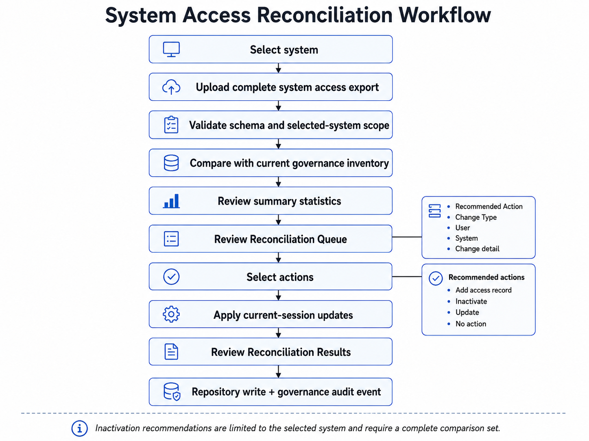

# AccessAtlas System Administrator Guide

This guide describes the current AccessAtlas experience for the **System Administrator** application role.

A System Administrator is scoped to systems assigned through active system administrator assignments.

## System Administrator Role Scope

A System Administrator can access:

```text
Dashboard
My Access
Manage Access
Access Reconciliation
```

The current scope model provides:

- actively administered systems
- users associated with those systems
- access assignments associated with those systems and visible users
- administrator assignments associated with the administered-system scope

A System Administrator assigned to multiple systems receives the combined scope of those active assignments.

Inactive administrator assignments do not expand scope.

## Dashboard

The Dashboard summarizes the current administered-system scope.

Use the metrics to identify:

- visible users and systems
- access record volume
- items needing review
- compliance concerns
- reconciliation actions

`Access Management Summary Stats` provides five source summary tables:

- User Record Status
- Compliance Status
- Access Records by System Type
- Access Records by Resource Type
- Access Records by Access Status

## My Access

My Access provides the System Administrator's own governance record.

Use:

- **My Record** to review personal compliance, access, and administrator assignments.
- **Update My Certification and Agreement Dates** to maintain the current user's reference compliance dates.

## Manage Access

### Managed Users


Managed Users shows only users available within the current administered-system scope.

Use the User Management Registry filters to narrow by:

- application role
- user type
- record status

Select a user to open the Selected User Access Profile.

Review:

- user governance attributes
- training and agreement dates
- access assignment metrics
- detailed access assignments
- administrator assignments

### Managed Systems


Managed Systems is the principal system-centered review surface.

The System Catalog is limited to systems the current user actively administers.

Select a system to open the Selected System Access Profile.

Review:

- system type and category
- owner and administrator group
- resource scope
- access model
- tracking method
- users with access
- system administrators
- resources and permissions

### Edit / Add Access

System Administrators can perform direct maintenance only within administered-system scope.

The work area contains:

```text
Add / Edit Access
Add User
```

#### Add / Edit Access


Use this workflow to create a new access assignment or edit an existing assignment.

An access assignment represents:

```text
User -> System -> Resource -> Permission
```

The System Administrator can select only systems and users available in the current application scope.

Applied changes are persisted through the active Access Assignment repository and recorded as governance audit events.

#### Add User


The Add User workflow demonstrates creation of a new governance user record and an optional initial access assignment.

The active repository determines persistence behavior.

In the public reference implementation, repositories are CSV-seeded and session-backed, so changes are disposable.

## Access Reconciliation

### System Access Export File Upload


System access reconciliation is performed one system at a time.



The recommended sequence is:

1. Select the system.
2. Confirm that the source export is complete for that system.
3. Upload the access export.
4. Review schema validation and uploaded records.
5. Review the reconciliation summary.
6. Filter and inspect the Reconciliation Queue.
7. Select recommended actions to apply.
8. Apply current-session updates.
9. Review Reconciliation Results.

Recommended actions are:

```text
Add access record
Inactivate
Update
No action
```

The selected-system restriction is important.

An access record should be recommended for inactivation only when it is missing from a complete comparison set for the system being reviewed.

### Training Certificate Date and Agreement Reconciliation


This workflow compares external compliance dates with the scoped user registry.

It evaluates:

- annual training date
- biennial training date
- access agreement date

Review differences before applying selected actions.

The workflow may update compliance dates or inactivate a user record where the selected recommendation calls for that action.

## Reconciliation vs Access Review

Reconciliation asks whether AccessAtlas matches the source.

It does not decide whether a user should retain access.

Formal access-review and approval processes remain outside the current core application.

## System Administrator Limitations

The System Administrator role cannot:

- see systems outside active administrator assignments
- manage access for out-of-scope systems
- access AccessAtlas App Admin
- administer organization-wide compliance
- manage system administrator assignments
- review Governance Audit History

## Demo Mode Note

The hosted demo simulates System Administrator scope through synthetic administrator assignments.

It is not authentication or a production authorization control.
