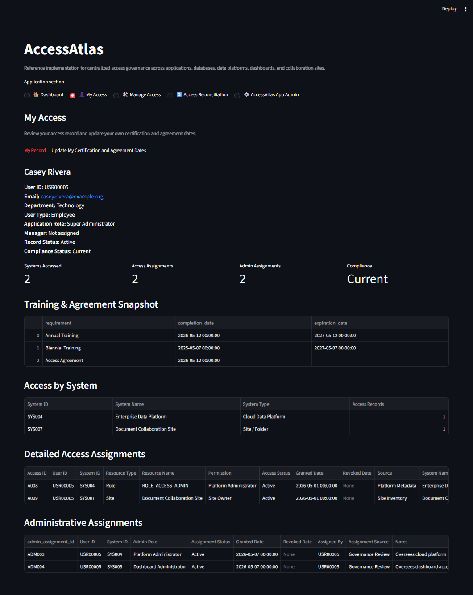
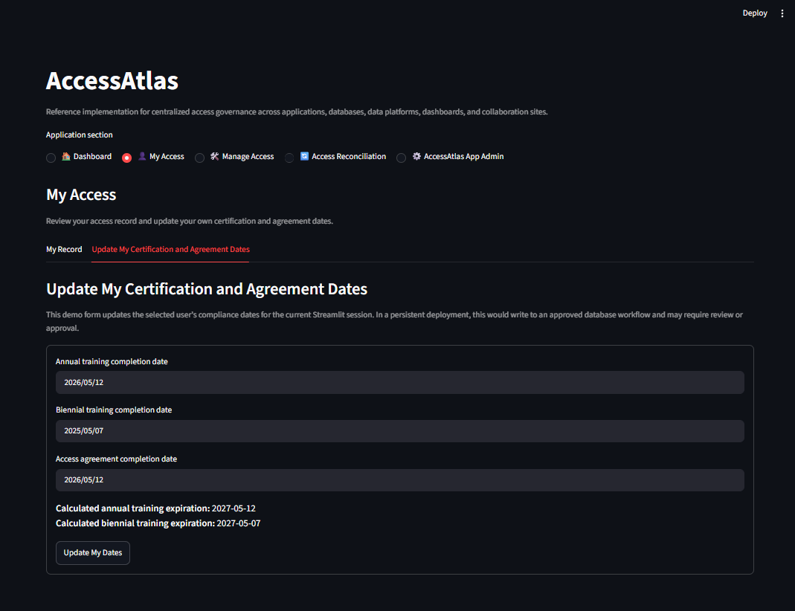

# AccessAtlas User Guide

This guide describes the current AccessAtlas experience for the **User** application role.

The hosted demo uses synthetic users and disposable current-session data. Production deployments may use different identity, persistence, and approval processes.

## User Role Scope

The User role can access:

```text
My Access
```

A User sees only their own governance record through the current AccessAtlas role and scope model.

The reference UI does not expose:

- Dashboard
- Manage Access
- Access Reconciliation
- AccessAtlas App Admin

## My Access



My Access contains two tabs:

```text
My Record
Update My Certification and Agreement Dates
```

## My Record

My Record provides the current user's governance profile.

The page may show:

- profile and organizational information
- compliance dates and status
- access assignments
- access by system
- detailed resource and permission assignments
- system administrator assignments, where applicable

### Compliance information

The reference model tracks:

- annual training date
- biennial training date
- access agreement date

AccessAtlas derives current compliance status from these dates.

Reference statuses are:

```text
Current
Expiring Soon
Expired
```

The reference application uses a 30-day expiring-soon window.

### Access assignments

The access section describes:

```text
User -> System -> Resource -> Permission
```

An assignment may represent:

- application access
- a platform role
- database or table permission
- dashboard access
- site membership
- another controlled resource

### Administrative assignments

Administrative assignments are separate from ordinary access.

They describe:

```text
User -> System -> Administrative Role
```

A user may see administrator assignments in My Record if they are responsible for administering a governed system.

## Update My Certification and Agreement Dates



This tab demonstrates self-service maintenance of:

- annual training date
- biennial training date
- access agreement date

After submission, the reference repository updates the current session's user record and records a governance audit event.

The default reference repository is CSV-seeded and session-backed.

That means:

- source CSV files are not changed;
- current-session changes are disposable;
- a new or cleared session returns to the reference seed data.

A production deployment may use persistent repositories and may add approval or validation requirements.

## What a User Cannot Do

The current User role cannot:

- browse other users
- browse the system catalog
- add or edit access assignments
- reconcile source-system access
- review organization-wide compliance
- administer system administrator assignments
- review governance audit history

## Demo Mode Note

The hosted Demo Mode simulates role visibility.

It is not authentication or production authorization.

Production deployments must integrate approved identity and enforce user scope below the Streamlit UI.
